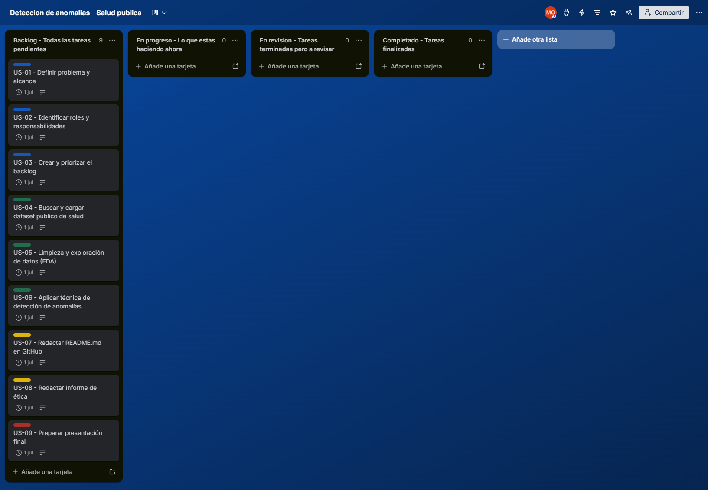
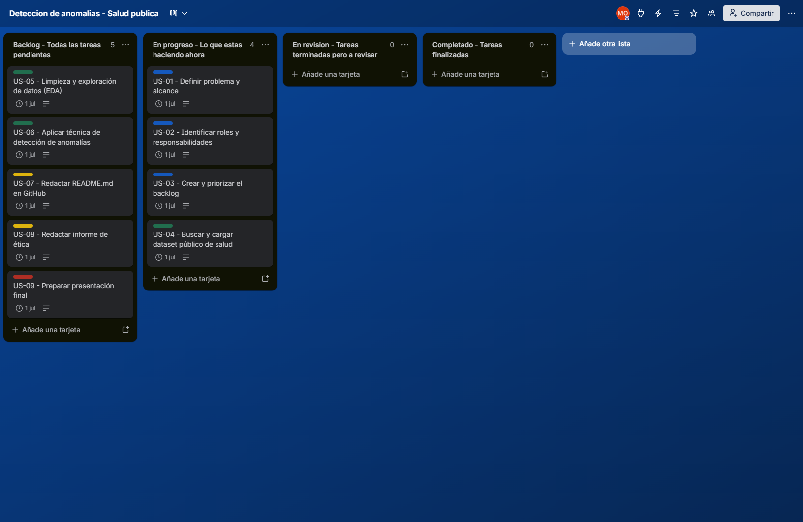
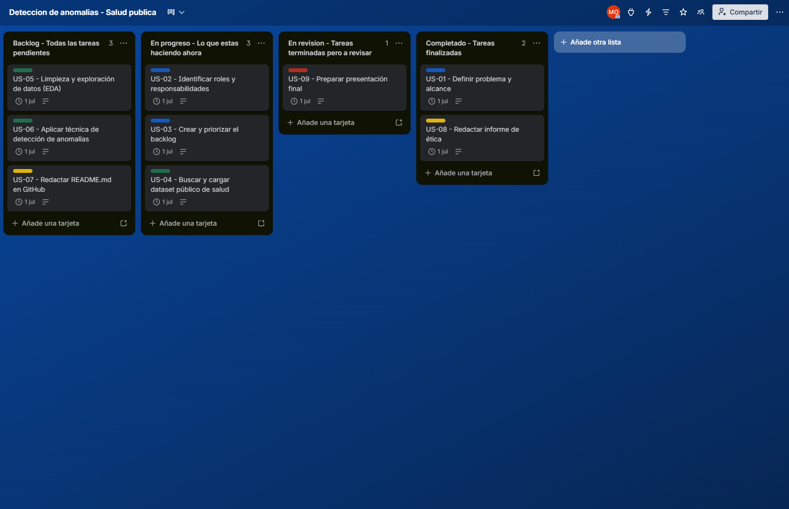

<h1 align="center">🏥 Detección de Anomalías en Datos de Salud Pública</h1>

## Autor

**Orlando Martin**  
Tecnicatura Superior en Ciencia de Datos e Inteligencia Artificial  
Instituto Nuevos Aires — 2025

  
  
  

---

## Descripción del Proyecto

Este proyecto simula un entorno profesional de Ciencia de Datos orientado a la
detección de anomalías en datasets de salud pública. El objetivo es identificar
valores atípicos o patrones inusuales que puedan indicar errores de carga,
situaciones críticas o inconsistencias en los datos.

---

## Objetivo

Diseñar y ejecutar un pipeline de detección de anomalías sobre datos públicos
de salud, aplicando metodología ágil (Scrum) y herramientas colaborativas
(Trello, GitHub).

---

## Roles del Equipo

| Rol | Responsabilidad |
|-----|----------------|
| Product Owner | Define el problema y prioridades |
| Data Engineer | Recolección y limpieza de datos |
| Data Scientist | Análisis y detección de anomalías |
| Documentador / QA | Documentación y control de calidad |

---

## Tecnologías Utilizadas

- Python 3.x
- Pandas
- Matplotlib / Seaborn
- Scikit-learn
- Trello (gestión ágil)
- GitHub (control de versiones)

---

## Metodología

Se utilizó la metodología **Scrum** con un único sprint de 7 días:

- **Sprint 1:** Planificación, exploración de datos, análisis y documentación

El backlog y el seguimiento del sprint se gestionaron mediante **Trello**.

---

##  Evidencia del Sprint en Trello

### Inicio del Sprint

### Mitad del Sprint

### Fin del Sprint

---
## Estructura del Repositorio
deteccion-anomalias-salud-publica/

│

├── README.md

├── datos/

│   └── dataset_salud.csv

├── notebooks/

│   └── analisis_anomalias.ipynb

└── informes/

└── informe_etica.md

---

## Ética y Responsabilidad

Ver informe completo en `/informes/informe_etica.md`

---
